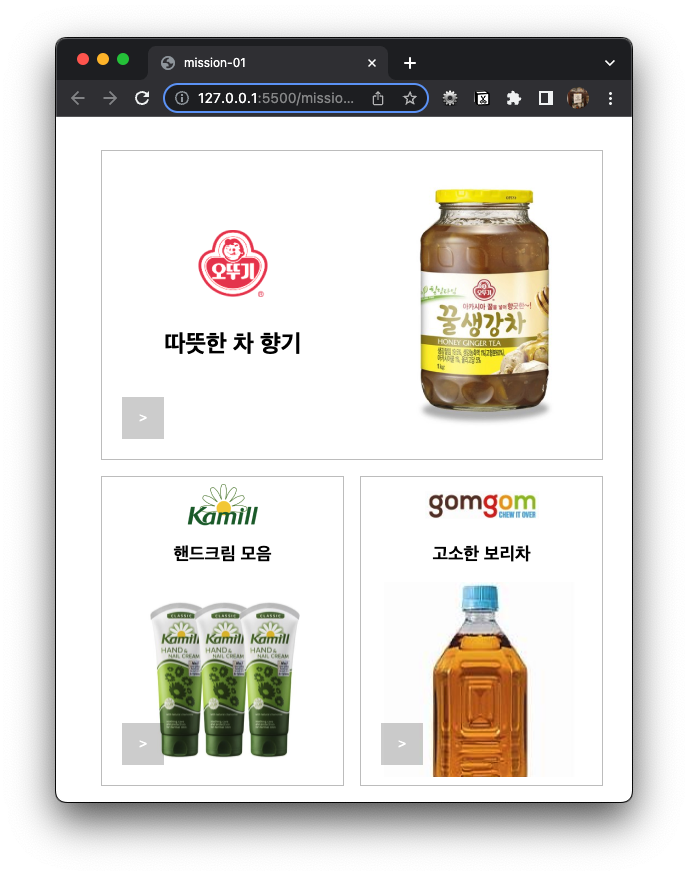
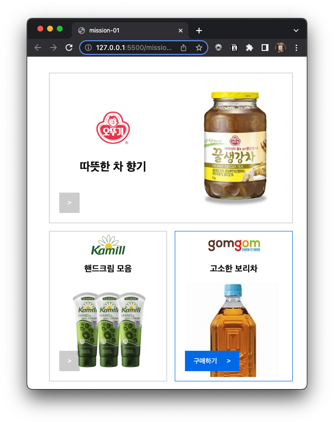

### 📌 mission-01

- 카드와 버튼의 호버 효과
   

### 🔍 Preview

|        카드와 버튼 호버 X         |                  카드 호버                   |                   버튼 호버                    |
| :-------------------------------: | :------------------------------------------: | :--------------------------------------------: |
|  |  |  |

   
  
### 📝 Description

- **[HTML]**

  1. 생강차와 핸드크림, 보리차를 독립적인 콘텐츠라 생각하여 `<section>` 태그 사용

     → **사진 등을 사용하는** 독립적인 콘텐츠에 사용하는 `<figure>` 태그로 변경

  2. `<section>`, `<article>` 태그를 사용하기 위해 `<h1>`, `<h2>` 태그 사용

     → `<figure>` 태그로 변경하여 `<h1>`, `<h2>` 태그를 `` 태그로 변경

  3. `>`, `구매하기 >`는 버튼처럼 생겨서 `<button>` 태그 사용

     → `구매하기` 클릭 시 단순한 페이지 이동이므로 `<a>` 태그로 변경

- **[CSS]**

  1. `<a>` 태그
     - `content` 사용: 마우스를 올리거나 클릭하기 전에는 `>`를, 후에는 `구매하기 >`를 나타내기 위해 사용
     - `position` 사용: 특정 위치에 고정하기 위해 부모에 `relative`를, `<a>` 태그에 `absolute`를 사용하고 `bottom`, `left`를 지정
     - `transition` 사용: `>`에서 `구매하기 >`로 자연스럽게 바뀌게 하기 위해 사용
  2. 공통 속성 합치기

     위치를 가운데로 배치하기 위해 `flex` 속성을 많이 사용하였는데 공통된 부분이 많아 한 곳에서

     `display: flex;`, `justify-content: center;`, `align-items: center;` 속성을 묶어놓았다.

     이외에도 `jucstify-content: space-between;`, `flex-direction: column;` 은 모든 `display: flex;`에서 사용하는 속성이 아니라 필요한 부분에서만 사용

### 💬 Common Feedback

- `<section>`, `<article>` 태그보다는 이미지가 2개 이상 들어가기 때문에 `<figure>`를 사용하면 좋을 것 같다.
- `<section>`, `<article>` 태그를 사용할 거면 설명 넣었으면, 아니라면 `
`를 사용하면 좋을 것 같다.
- README.md에서 코드는 보면 이해할 수 있으니 ㅁㅁㅁ에 대한 고민 끝에 ㅇㅇㅇ 방식으로 코드를 작성했다는 해설을 작성하면 좋을 것 같다.
- ‘구매하기’는 `<button>` 태그보다는 `<a>` 태그를 사용하면 좋을 것 같다.
- ``의 `alt` 속성은 눈이 안 보였다고 생각하고 작성하기 ex. 병으로 된 꿀 생강차 한 병 1KG
  → 담긴 무언가에 대한 설명도, 크기도, 무게도 작성해 주기
- HTML에서 `title`을 사용해 tooltip을 볼 수 있게 해주는 것은 좋지만 중복되지 않게 하는 것도 중요하다.
- 클래스 이름은 공통적으로 사용하기 ex. single, double

### ⁉️ 궁금증 해결

1. ‘구매하기’를 `<a>` 태그로 하는 것이 좋은 이유는?

   `<a>` 사용: `<a>` 태그는 하이퍼링크를 나타내는 표준 HTML 요소

   사용자에게 목적지 페이지로 이동하는 링크를 제공할 때 가장 적합하며 `href` 속성으로 링크의 목적지 URL을 지정할 수 있다.

   `<button>` 사용: 주로 양식 제출이나 상호작용 버튼을 나타낼 때 사용하는 HTML 태그

   👉 ’구매하기’를 클릭하는 목적이 단순한 페이지 이동일 경우, `<a>` 태그를 사용하는 것이 논리적이다.

### 💡 알게 된 점

- ~~이미지가 2개 이상일 때는 `<section>`, `<article>` 태그를 사용하는 것 보다는 `<figure>` 태그를 사용하는 것이 접근성 측면에서 좋다는 것을 알게 되었다.~~
- `<section>`, `<article>` 태그를 사용하려면 제목을 입력해야 한다. 하지만 이번 과제에서는 제목을 적을 게 아니라면 `<figure>`를 사용하는 것이 좋다.
- 버튼처럼 생겨서 `<button>` 태그를 사용했는데 `<a>` 태그를 사용해야 했음을 알게 되었다.
