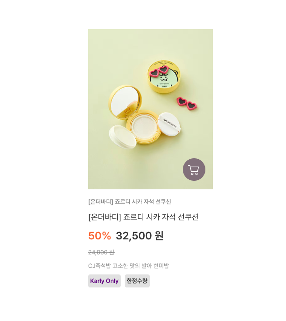
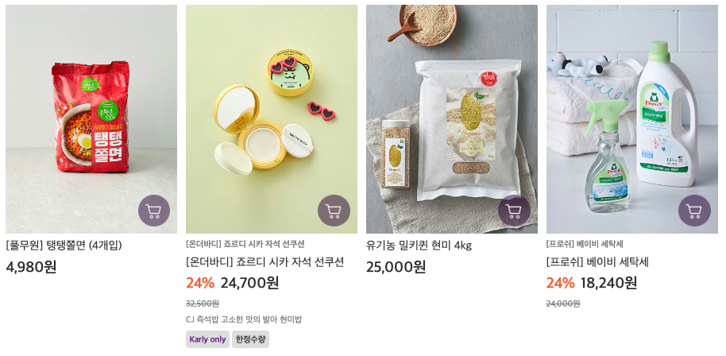
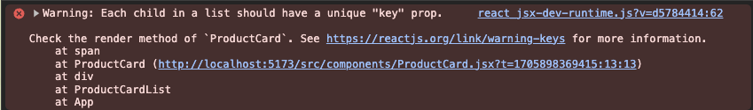

### 1주차 과제

- [x] JSX 또는 React API를 사용해, Vanilla 프로젝트에서 구현한 인터페이스의 일부를 마크업하여 웹 브라우저에 렌더링되도록 만듭니다.
- [x] 과제를 수행한 과정을 기록해 README.md를 작성합니다.

### CRA(:Create React App)이 아닌 vite로 react app 설치

```bash
pnpm create vite .
```

### Vanilla 프로젝트에서 구현한 인터페이스의 일부 마크업(마켓칼리)

|       디자인 시안       |          완성 이미지          |
| :---------------------: | :---------------------------: |
|  |  |

1. **📁 src/data/productList.js**

   ```jsx
   {
     imageSrc: 'src/assets/product02.png', // *
     imageAlt: '분홍색 하트 자석 선글라스가 포함된 선쿠션', // *
     brand: '[온더바디] 죠르디 시카 자석 선쿠션',
     title: '[온더바디] 죠르디 시카 자석 선쿠션', // *
     discount: 24,
     price: 32500, // *
     description: 'CJ 즉석밥 고소한 맛의 발아 현미밥',
     labelList: ['Karly only', '한정수량'],
   }
   ```

   - 필수(\*): `imageSrc`, `imageAlt`, `title`, `price`
   - 옵션: `brand`, `discount`, `description`, `labelList`
   - 필수적인 데이터는 늘 가져오고, 옵션이 있다면 해당 옵션을 가져올 수 있도록 만들었습니다.
     ```jsx
     brand && <span className="brand">{brand}</span>;
     discount ? formatPrice(discountPrice) : formatPrice(price);
     ```

2. **📁 src/components/** : 상품 카드와 상품 카드 리스트에 대한 스타일
   - [상품 카드(ProductCard)](./src/components/ProductCard.jsx)
   - [상품 카드 리스트(ProductCardList)](./src/components/ProductCardList.jsx)
   - 순서: 정적인 상품 카드 → 동적인 상품 카드 → 상품 카드 리스트(map)
   - `forEach` vs. `map`
     - `forEach`: 각 배열 요소에 대한 작업을 수행한다. 새로운 배열을 반환하지 않는다.
     - `map`: 각 요소에 대한 작업을 수행하고 그 결과로 새로운 배열을 반환한다.
   - `map`에서의 `key`를 사용하는 이유(with. `ProductCardList`)
     ```jsx
     labelList.map((labelName, index) => (
       <span
         key={index}
         className={`label${labelName === 'Karly only' ? ' only' : ''}`}>
         {labelName}
       </span>
     ));
     ```
     - 배열을 렌더링할 때 각 요소에 고유한 `key`를 제공하는 것이 좋다고 하지만, `key`를 넣지 않으면 에러가 발생한다.
       
     - 리액트가 업데이트된 요소를 효율적으로 식별하고 관리하기 위해 `key`를 사용한다.
