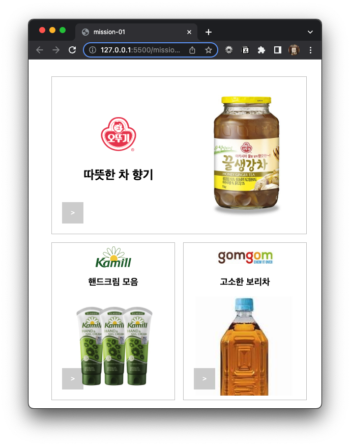
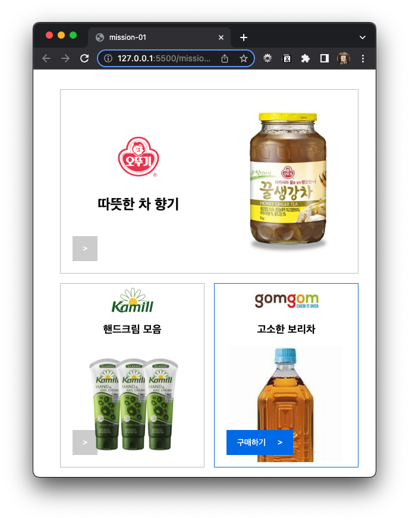

### 📌 mission-01

- 카드와 버튼의 호버 효과
   

### 🔍 Preview

|        카드와 버튼 호버 X         |                  카드 호버                   |                   버튼 호버                    |
| :-------------------------------: | :------------------------------------------: | :--------------------------------------------: |
|  |  |  |

   
  
### 📝 Description

- 카드에 마우스 커서를 올리면 테두리가 회색에서 파란색으로 변합니다.
- 왼쪽 꺽쇠(>) 버튼을 누를 수 있음을 알리기 위해 커서를 포인터로 변경하였고 버튼에 마우스 커서를 올리거나 클릭하면 구매하기 버튼으로 바뀌도록 했습니다.

### 💬 Common Feedback

- [x]  `<section>`, `<article>` 태그보다는 이미지가 2개 이상 들어가기 때문에 `<figure>`를 사용했으면
- [x]  `<section>`, `<article>` 태그를 사용할 거면  설명 넣었으면, 아니라면 `
` 사용
- [ ]  README.md에서 코드는 보면 이해할 수 있으니 ㅁㅁㅁ에 대한 고민 끝에 ㅇㅇㅇ 방식으로 코드를 작성했다는 해설을 작성했으면
- [x]  ‘구매하기’는 `<button>` 태그보다는 `<a>` 태그 사용하기
- [x]  ``의 alt 속성은 눈이 안 보였다고 생각하고 작성하기 ex. 병으로 된 꿀 생강차 한 병 1KG
    
    → 담긴 무언가에 대한 설명도, 크기도, 무게도 작성해 주기
    
- HTML에서 `title`을 사용해 tooltip을 볼 수 있게 해주는 것은 좋지만 중복되지 않게 하는 것도 중요함
- 클래스 이름은 공통적으로 사용하기 ex. single, double

### ⁉️ 궁금증 해결

1. ‘구매하기’를 <a> 태그로 하는 것이 좋은 이유는?
    
    [`<a>` 사용] `<a>` 태그는 하이퍼링크를 나타내는 표준 HTML 요소
    
    사용자에게 목적지 페이지로 이동하는 링크를 제공할 때 가장 적합하며 `href` 속성으로 링크의 목적지 URL을 지정할 수 있다.
    
    [`<button>` 사용] 주로 양식 제출이나 상호작용 버튼을 나타낼 때 사용하는 HTML 태그
    
    👉 ’구매하기’를 클릭하는 목적이 단순한 페이지 이동일 경우, `<a>` 태그를 사용하는 것이 논리적이다.
    

### 💡 알게 된 점

- 이미지가 2개 이상일 때는 `<section>`, `<article>` 태그를 사용하는 것 보다는 `<figure>` 태그를 사용하는 것이 접근성 측면에서 좋다는 것을 알게 되었다.
- 버튼처럼 생겨서 `<button>` 태그를 사용했는데 `<a>` 태그를 사용해야 했음을 알았다.
