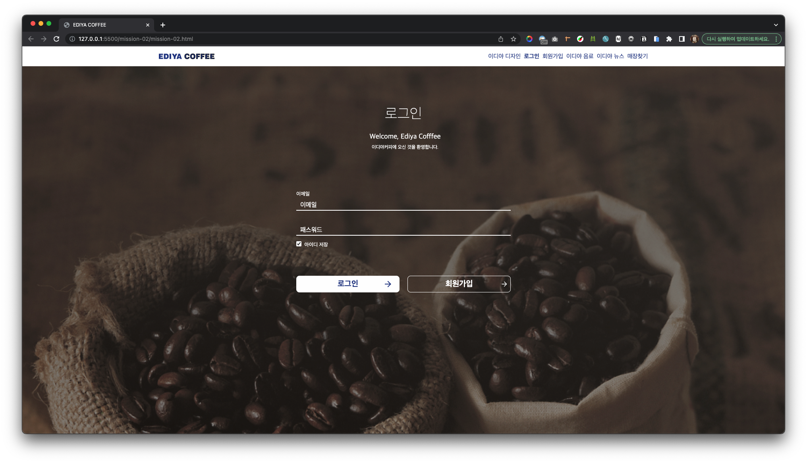
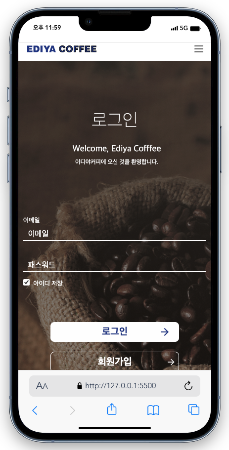
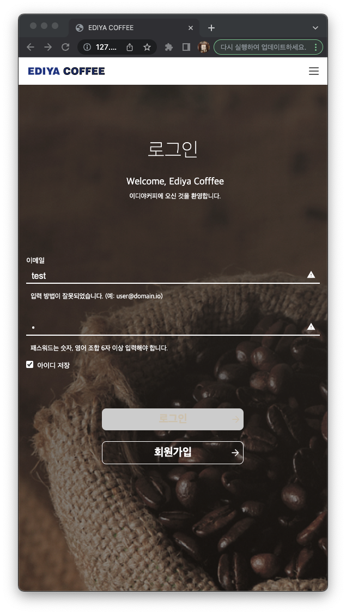
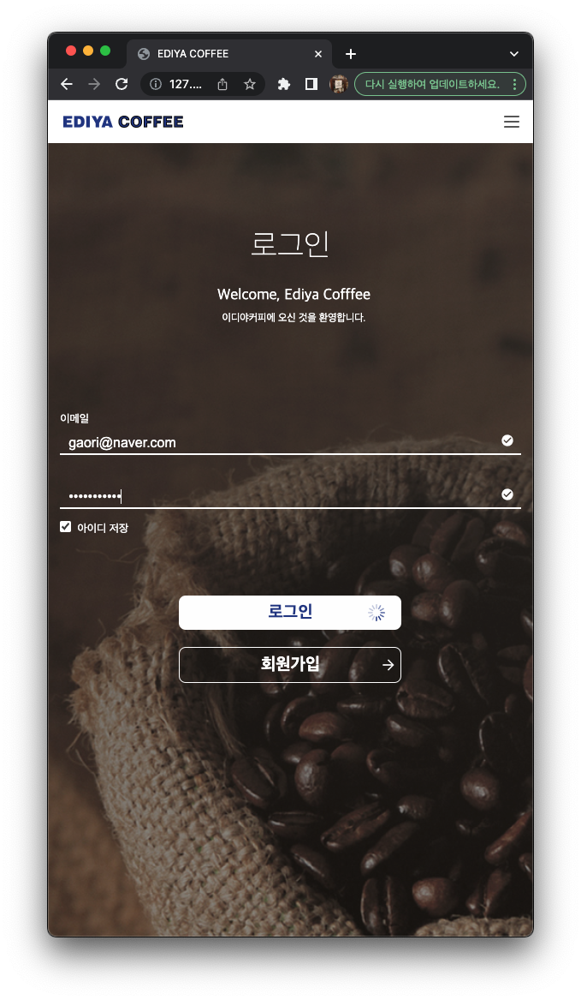
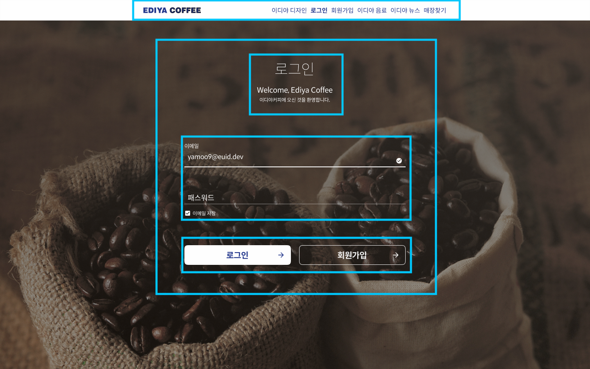

### 📌 mission-02

### 🔍 Preview

|                  Desktop                  |                  mobile                  |                  GIF                   |
| :---------------------------------------: | :--------------------------------------: | :------------------------------------: |
|  |  |  |

|             조건에 맞지 않음              |                조건에 맞음                |                  로딩중                   |
| :---------------------------------------: | :---------------------------------------: | :---------------------------------------: |
|  |  |  |

### 📝 Description

1. figma<br />
   <br />
   피그마를 봤을 때 위에서 아래로, 헤더, 로그인 텍스트 상자, 로그인 폼으로 나누었는데, 로그인 텍스트 상자와 로그인 폼을 하나로 묶었다.
   <br /><br />

2. `header`

   ```html
   <header>
     
     <ul>
       <li><a href="/">이디야 디자인</a></li>
       <li><a href="/">로그인</a></li>
       <li><a href="/">회원가입</a></li>
       <li><a href="/">이디야 음료</a></li>
       <li><a href="/">이디야 뉴스</a></li>
       <li><a href="/">매장찾기</a></li>
     </ul>
     
   </header>
   ```

   - 이디야 로고는 css에서 `font-weight: 900;`을 사용해도 디자인과 비슷한 두께가 나오지 않아 피그마의 디자인을 사용했다.
   - 메뉴는 리스트 태그를 사용해서 리스트의 스타일을 제거한 후 메뉴처럼 css를 사용했다.
     <br /><br />

3. `<form>`

   - `<input>` 태그 오른쪽에 경고, 체크마크 등 이미지가 필요하기 때문에 `<div>`를 사용해서 묶어서 사용했다.

   ```css
   .form-cover {
     width: 95%;
     min-width: 310px;
     max-width: 540px;
     text-align: left;
   }
   ```

   - `<form>`의 `width`를 95%로 지정했지만 가장 작을 때와 클 때를 `px`로 만들어서 모바일과 PC에서 볼 수 있게 만들었다.
     <br /><br />

4. `<button>`

   ```html
   <div class="button-cover">
     <button>로그인</button>
     <a href="/">회원가입</a>
   </div>
   ```

   - 로그인은 이메일과 비밀번호를 저장하지만 회원가입의 경우 회원가입 페이지로 이동하기 때문에 로그인은 버튼으로, 회원가입은 링크를 이용했다.
     <br /><br />

   ```css
   .button-cover button {
     background: var(--whyte) url(./images/right-arrow-blue.png) no-repeat 98% 50%;
   }
   .button-cover a {
     background: url(./images/right-arrow-white.png) no-repeat 95% 50%;
   }
   button.loading {
     background: var(--whyte) url(./images/loading.png) no-repeat 98% 50%;
   }
   ```

   - `<form>`의 `<input>` 태그의 경우 이미지를 클릭할 수 있게 하기 위해서 `` 태그를 사용했지만 로그인 버튼과 회원가입 버튼은 버튼을 클릭하기 때문에 `background`를 이용해서 배경에 이미지를 지정했다.
     <br /><br />

5. `media`

   ```css
   @media (max-width: 600px) {
     header {
       justify-content: space-between;
       padding-left: 18px;
     }
     header ul {
       display: none;
     }
     header .hidden {
       display: block;
     }
     .button-cover {
       justify-content: center;
     }
   }
   ```

   - 헤더의 로고와 메뉴는 점점 가까워지다가 메뉴가 햄버거 아이콘으로 변경될 수 있게 `<ul>` 태그를 지우고 햄버거 아이콘이 나타나게 만들었다.
   - 로그인과 회원가입 버튼도 점점 가까워지다가 1행이 아닌 2행으로 나눠지고 중앙으로 정렬했다.
